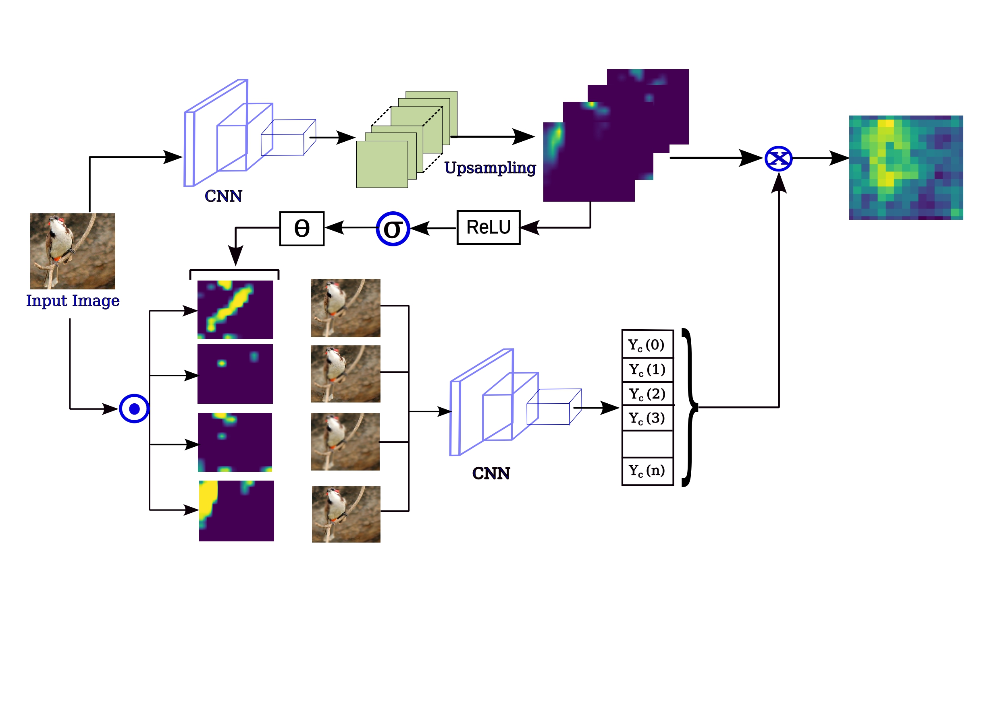

# [Reliable or Deceptive? Investigating Gated Features for Smooth Visual Explanations in CNNs](https://arxiv.org/abs/2404.19341)

[Soham Mitra](), [Atri Sukul](), [Swalpa Kumar Roy](https://swalpa.github.io), [Pravendra Singh](https://www.iitr.ac.in/~CSE/Pravendra_Singh), and [Vinay Verma](https://sites.google.com/view/vinaycse/home)

The repository contains the implementations for [Reliable or Deceptive? Investigating Gated Features for Smooth Visual Explanations in CNNs](https://www.researchgate.net/publication/381095591_Reliable_or_Deceptive_Investigating_Gated_Features_for_Smooth_Visual_Explanations_in_CNNs).

Citation
---------------------

**Please kindly cite the papers if this code is useful and helpful for your research.**

      @article{mitra2024reliable,
      title={Reliable or Deceptive? Investigating Gated Features for Smooth Visual Explanations in CNNs},
      author={Mitra, Soham and Sukul, Atri and Roy, Swalpa Kumar and Singh, Pravendra and Verma, Vinay},
      journal={arXiv preprint arXiv:2404.19341},
      year={2024}
      }

## Acknowledgement

Part of this code is implementated from [ScoreCAM](https://github.com/haofanwang/Score-CAM).

## License

Copyright (c) 2024 Soham Mitra. Released under the MIT License. See [LICENSE](LICENSE) for details.
